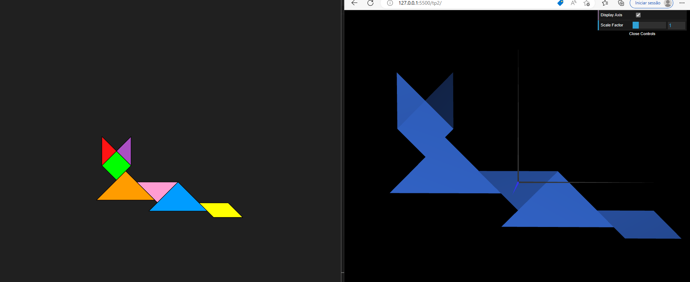
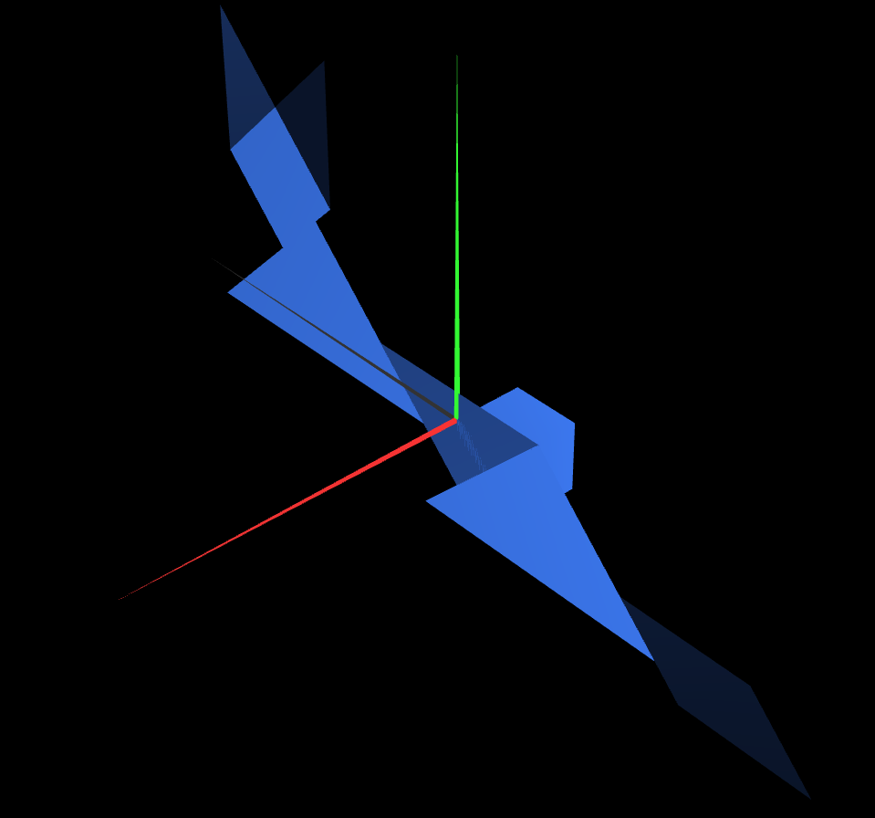
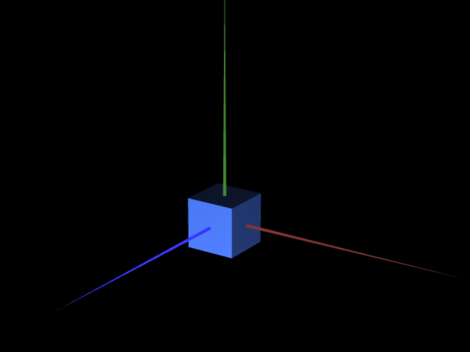

# CG 2022/2023

## Group T03G11

## TP 2 Notes

- In this class we learned how to apply transformations to figures (translate, rotate, scale) which we used to construct our tangram. We also made a cube using two different methods, one using all conections of the cube and other constructing is faces and applying to them the right transformations so it makes the cube.

