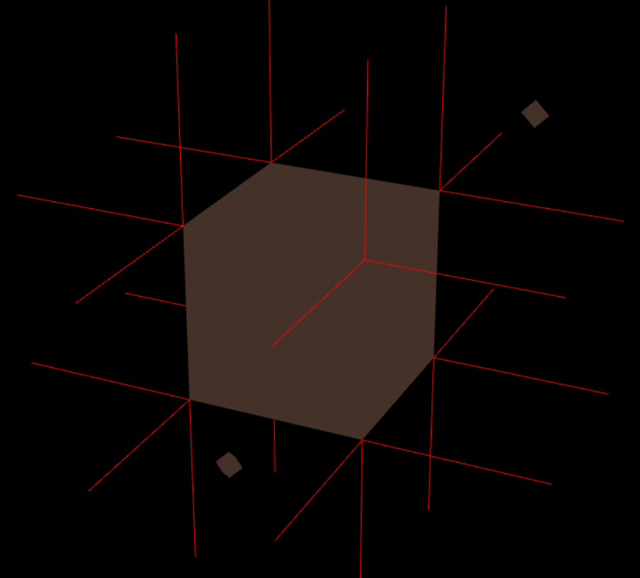
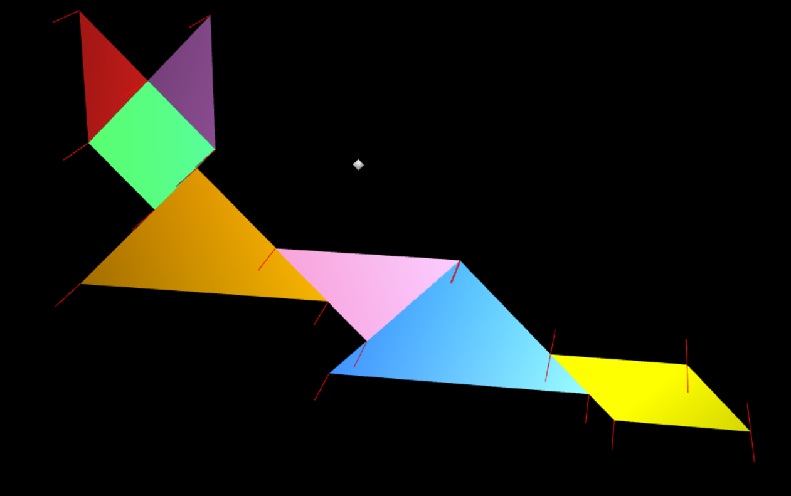
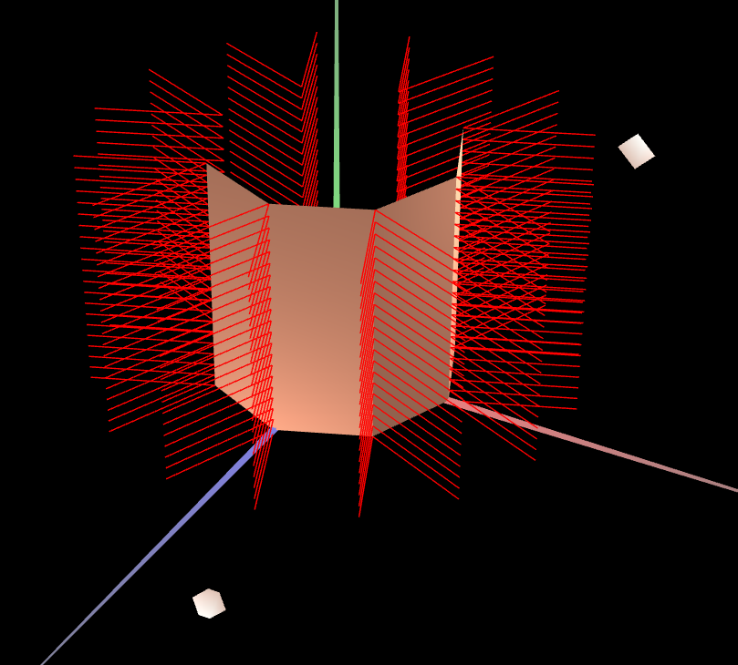
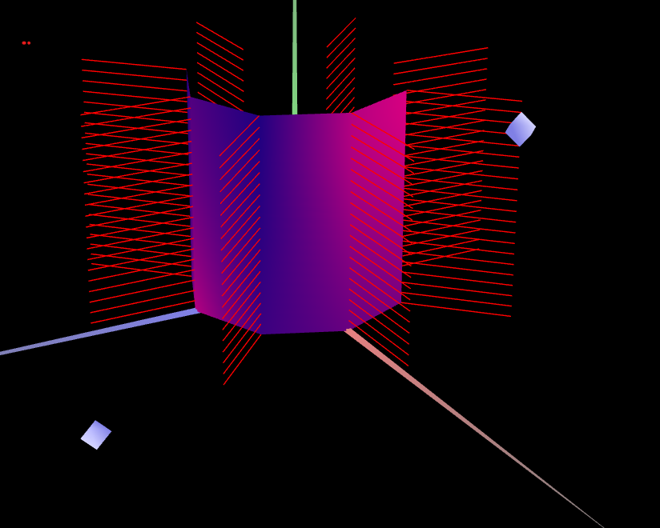

# CG 2022/2023

## Group T03G11

## TP 3 Notes

- In this class we learned how to construct normals in the figures and how to change the colors of each figure.

- We also learned how to manange the lights and how to costumize colors our way.

- In part two of the work we learned how to make a Prism and how to do a Cylinder.

